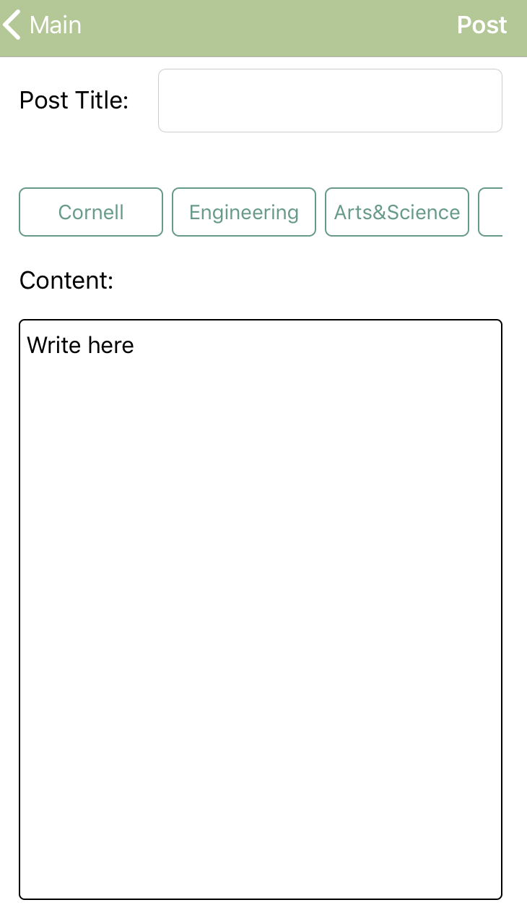
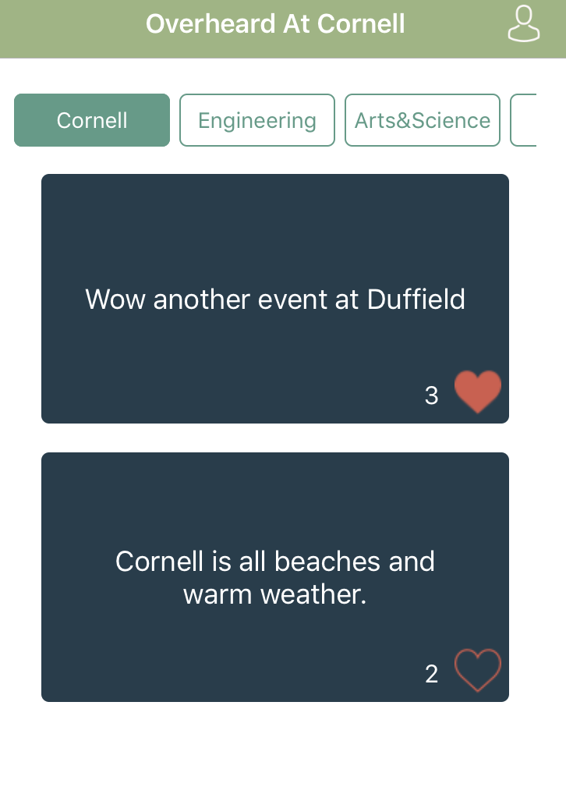
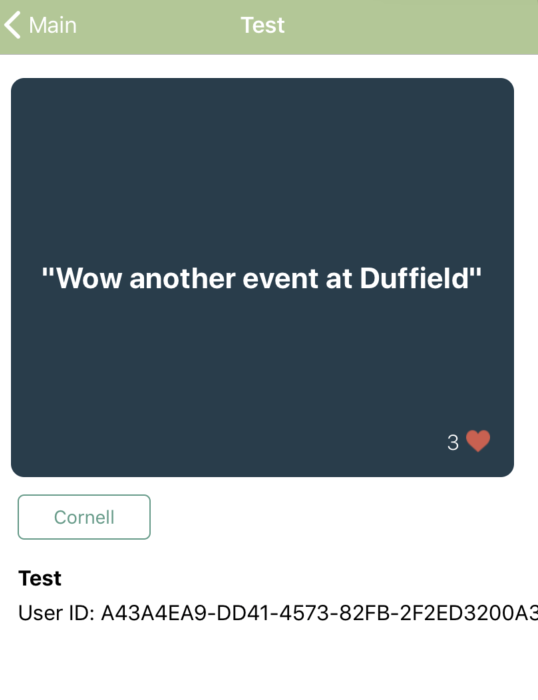
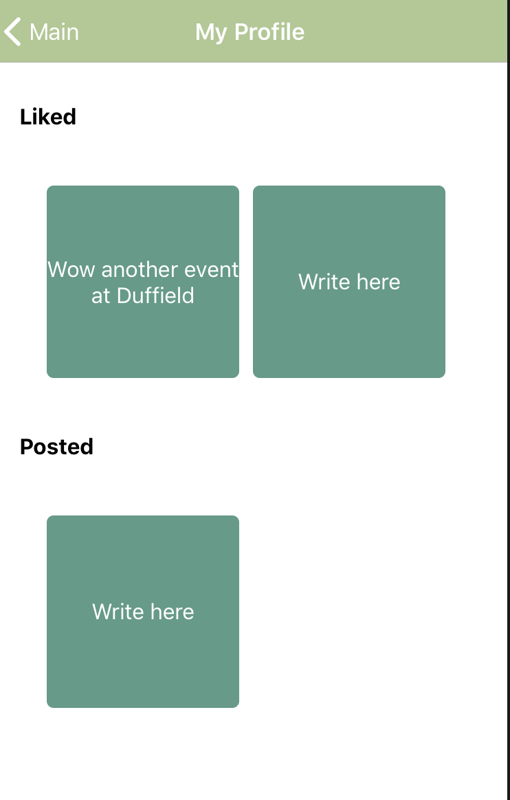

# sp19hackathon_overheard
Overheard At Cornell App

1.	Overheard At Cornell
2.	Our project is an iOS app version of Overheard At Cornell 
3.	Link(s) to any other public GitHub repo(s) of your app. If you have one repo for iOS and one for Backend, please link to your backend repo in your iOS README, and your iOS repo in your backend README.
	We only have one repository for the backend and the frontend at https://github.com/overheardatcornell/sp19hackathon_overheard.
4.

5.	Our app’s purpose is to create a forum for any user to make her or his voice heard by uploading an anonymous post. We have a feature of tags, which can be used as categories to filter posts and can be added when creating a new post. Furthermore, profile page allows the users to take a look at their liked posts or ones that they themselves have posted. When clicking on a post in a main page, users can view the details of a post, including its title, content, number of likes and etc.

6.	A list of how your app addresses each of the requirements (iOS / Backend)
	- Requirements for iOS
		- Our main page uses two collection views for filters and scrolling posts. Our profile page also has two collection views for viewing posts. 
		- We use NavigationController to navigate through different screens.
		- We integrated our app with the API backend developers created, which keeps a database of all the posts users upload.
		
	-Requirements for Backend
		-Designed an API to include relationships between users, posts, and comments. 
		-Used SQLAlchemy to develop the many to many relationships between liking posts and comments,
		and parent child relationships between users and posts, and posts and comments. 
		-Provided as many paths as possible to faciliate data gathering for the IOS team. 
		-Deployed to the Google Cloud with a Docker image.  
	
7.	Anything else you want your grader to know
	- iOS xcodeproj file and xcworkspace file are located inside the "jk2332_p5" foler.

Note: The link, screenshots, and description will be used for the Hack Challenge website where we will showcase everyone’s final projects
